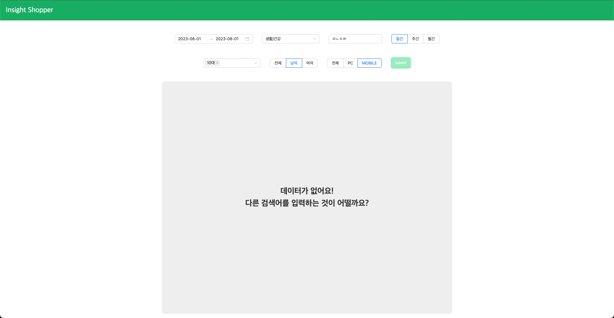
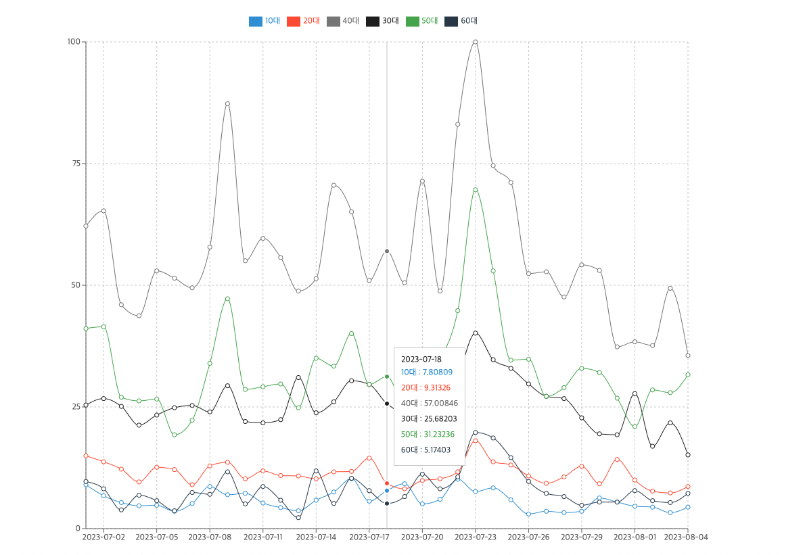

# 네이버 쇼핑 인사이트 api를 시각화 한 프로젝트

- 개발 인원 : 1인 (임재혁)
- 개발 기간 : 23.7.30 ~ 8.3

## 사용한 기술 스택

- node , express ,aws lamda
- react, typescript
- redux-toolkit
- styled-components,Antd
- recharts

## 설치 및 실행 방법

```
## Express Server
cd server && npm install && npm start

## React
cd client && npm install && npm start
```

## 구현사항

### 1. Layout

- 반복되는 `헤더, 바디` 템플릿화
- code path : components/@layout

### 2. 각 연령별 트렌드 조회의 파라미터 사용자가 입력 가능

- src/component/forms 폴더에 각각 카테고리를 선택 할 수 있는 컴포넌트를 만들어 구현하였습니다.
- src/store/reducers/shoppingslice.ts를 만들어 상태관리를 하였습니다.
  

### 3. .env

- API KEY들을 .env 파일에 저장한 후 import 하여 사용하고 gitignore 파일에 .env를 저장하였습니다.

### 4. cors 에러 해결

- express server를 proxy server로 두어서 통신을 하게 했고, express server는 cors를 허용하여 client 요청을 대신 처리하게 해 주었습니다.
- 네이버 open api를 사용하다 보니 여러가지 cors에러를 해결하기 위한 방법 중 proxy server를 두는것을 선택했습니다.

### 5. rechart.ts

- recharts.ts를 활용하여 조회 결과에 대한 데이터를 그래프로 시각화 하여 보여주었습니다.



### 6. ages 다중선택

- 연령별 트렌드 조회의 파라미터 **ages** 를 **다중 선택**할 수 있도록 구현였습니다.

### 선택 구현사항

- [v] Antd를 활용하여 각종 form들을 사용했습니다.(select,rangepicker,input,radiobutton 등 )

- [v] custom hooks를 사용하였습니다.
